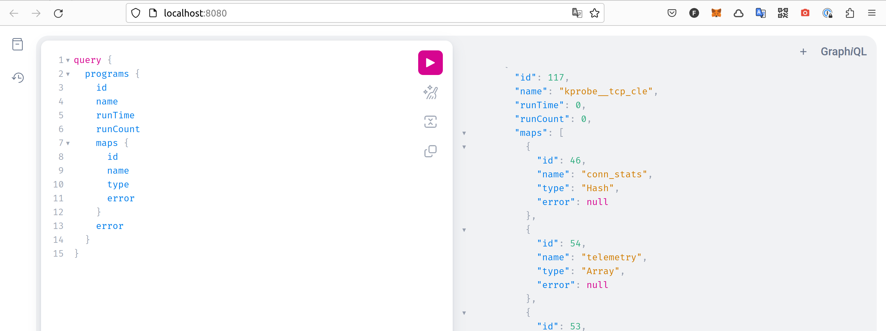
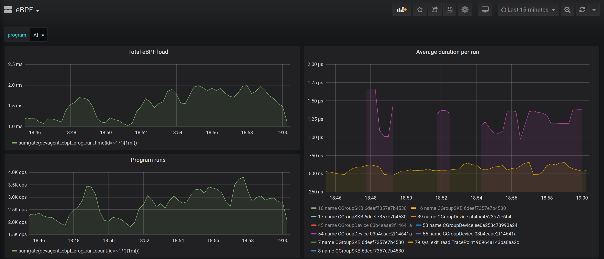
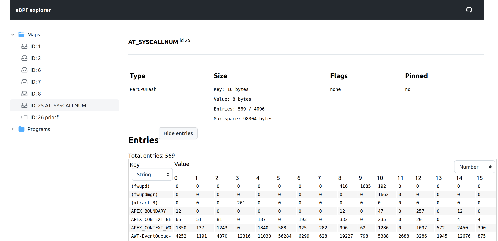

# dev-agent
This agent provides access to system's eBPF-programs and maps to perform remote debugging.

Features:
* GraphQL model for maps and programs
* Prometheus metrics exporter (including values of maps entries)

See also [CHANGELOG](./CHANGELOG.md).

# Usage

## Server

```shell
sudo ./phydev server [--help]
```

GraphQL interface: [http://localhost:8080/](http://localhost:8080/)

Prometheus endpoint: [http://localhost:8080/metrics](http://localhost:8080/metrics)

Schema: [pkg/graph/schema.graphqls](pkg/graph/schema.graphqls)



### Prometheus endpoint

Metrics scrape endpoint for Prometheus: [http://localhost:8080/metrics](http://localhost:8080/metrics)

* program metrics:
  * `devagent_ebpf_prog_count` - number of eBPF programs by `type`
  * runtime metrics only available with `sysctl -w kernel.bpf_stats_enabled=1`:
    * `devagent_ebpf_prog_run_count` - number of times an eBPF program has been run (by `id`, `name`, `tag`, `type`)
    * `devagent_ebpf_prog_run_time` - total time spent running eBPF programs (by `id`, `name`, `tag`, `type`)
* map metrics:
  * `devagent_ebpf_map_count` - number of eBPF maps by `type`
  * if map export is configured (see below):
    * `devagent_ebpf_map_entry_count` - number of entries in an eBPF map (by `id`, `name`, `type`)
    * `devagent_ebpf_map_entry_value` - value of an eBPF map entry (by `key`, `cpu`, `id`, `name`, `type`)

You can find example of Grafana dashboard in [grafana-ebpf-dashboard.json](./grafana-ebpf-dashboard.json):


#### Configuring map export

As an example, I'm running this [bpftrace](https://github.com/iovisor/bpftrace) program:
```shell
sudo bpftrace -e 'tracepoint:raw_syscalls:sys_enter { @SYSCALLNUM[comm] = count(); }'
```

You could see the name of created map - `AT_SYSCALLNUM`, and the map content in [ebpf-explorer](https://github.com/ebpfdev/explorer):


By default, dev-agent doesn't export map entries to Prometheus, as it may introduce some performance issues.

Instead, you could set an option `--etm -:AT_SYSCALLNUM:string` when running server, which will suggest agent which map entries to expose in /metrics.

For this HASH_PER_CPU map, it will export 2 metrics:
```text
# HELP devagent_ebpf_map_entry_count Number of entries in an eBPF map
# TYPE devagent_ebpf_map_entry_count gauge
devagent_ebpf_map_entry_count{id="25",name="AT_SYSCALLNUM",type="PerCPUHash"} 764
# HELP devagent_ebpf_map_entry_value Value of an eBPF map entry
# TYPE devagent_ebpf_map_entry_value gauge
devagent_ebpf_map_entry_value{cpu="0",id="25",key="(anacron)",name="AT_SYSCALLNUM",type="PerCPUHash"} 0
devagent_ebpf_map_entry_value{cpu="0",id="25",key="(fprintd)",name="AT_SYSCALLNUM",type="PerCPUHash"} 0
```

This is how it may look in Grafana (top 10 processes doing most of syscalls):


Run `./phydev server --help` for more details on this flag.

## CLI commands

These are just for debugging purpose, use [bpftool](https://github.com/libbpf/bpftool) instead

List loaded eBPF programs:

```shell
sudo ./phydev inspect progs list
> ID      Type    Tag     RunCount        RunTime AvgRunTime
> 3               CGroupDevice    e3dbd137be8d6168        0       0s      0s
> 4               CGroupSKB       6deef7357e7b4530        0       0s      0s
> 125     uprobe__BIO_new Kprobe  0d9ea14e5516f975        0       0s      0s
> 126     socket__http_fi SocketFilter    6b7ab673cb23d3f0        0       0s      0s
> 127     kretprobe__do_s Kprobe  154f35d6575c73f9        0       0s      0s
> 128     uretprobe__SSL_ Kprobe  8737d2e349595de3        0       0s      0s
```

List loaded eBPF maps:

```shell
% sudo ./phydev inspect maps list 
ID      Name    FD      Type    Flags   IsPinned        KeySize ValueSize       MaxEntries
1               3       Hash    0       false   9       1       500
2               4       Hash    0       false   9       1       500
44      do_sendfile_arg 10      Hash    0       false   8       8       1024
61      http_in_flight  27      Hash    0       false   48      112     10000
62      http_notificati 28      PerfEventArray  0       false   4       4       16
63      open_at_args    29      Hash    0       false   8       128     1024
```

## Docker

Instead of `./phydev server`, use docker command:

```shell
docker run -ti --rm --privileged -p 8080:8080 ghcr.io/ebpfdev/dev-agent:v0.0.2 server
```

# Development

## Build
```shell
go build -o phydev cmd/dev-agent/main.go
```

## Update GraphQL models from schema

To update GraphQL models, run:
```shell
go generate ./...
```
